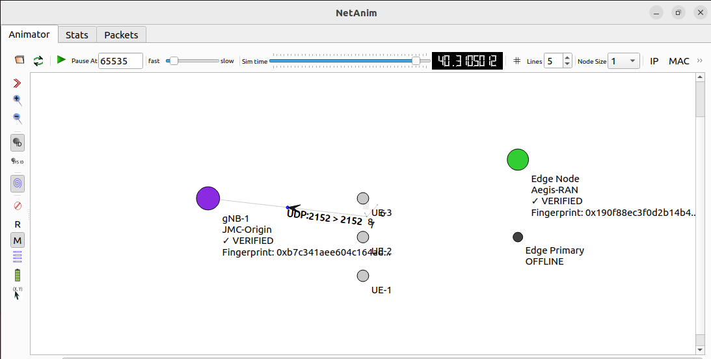

# ACELOGIC™ Phase 1

## Deterministic Identity Continuity in 5G NR (NS‑3)

[](https://www.nsnam.org/)
[](https://5g-lena.cttc.es/)
[](https://www.openssl.org/)
[](LICENSE)

---

## Overview

This repository contains a **Phase 1 validation** of deterministic identity continuity for autonomous agents operating inside a 5G NR radio access network.  
We demonstrate that an agent’s identity can be:

- **Immutable** across crashes, restarts, migration, and network partitions  
- **Non‑duplicable** (split‑brain detection and elimination)  
- **Verifiable** under realistic channel conditions and traffic loads  

The experiment is implemented as an **NS‑3** simulation using the 5G‑LENA NR module and SHA‑256 cryptographic fingerprints.

---

## Validation Objectives

1. **Identity binding** – Each agent derives a deterministic fingerprint from immutable attributes.  
2. **Invariance** – The fingerprint remains unchanged across all lifecycle events.  
3. **Split‑brain suppression** – The baseline system allows duplicates; the identity‑enforced system prevents them.  
4. **Deterministic verification** – A root‑of‑trust agent (Twin) verifies the enterprise agent after every disruption.

---

## Deterministic Identity Model

An agent’s identity is **not** tied to runtime state. Instead, it is computed as:

```
Fingerprint = SHA-256(
    AGENT_ID + "|" +
    AGENT_NAME + "|" +
    OWNER + "|" +
    IDENTITY_NAMESPACE + "|" +
    GENESIS_TIME + "|" +
    LINEAGE + "|" +
    MISSION
)
```

Where `+` denotes concatenation and `"|"` is a separator to avoid collisions.  
All fields are taken from the agent’s **Immortal ID Card** (see PDFs in `/assets`).

**Example – JMC‑Origin (Twin Agent)**  
- `LINEAGE = ROOT`  
- `MISSION = "Canonical continuity anchor ..."`  
→ Fingerprint: `0xb7c341aee604c164ada1f1b67f31c2b5860d1542d154f09c6cb703fc259bc965`

**Example – Aegis‑RAN (Enterprise Agent)**  
- `LINEAGE = JMC-Origin`  
- `MISSION = "Autonomous optimization ..."`  
→ Fingerprint: `0x190f88ec3f0d2b14b4f9538e62fcfef76da2b0b1676949a6589a60d5b9cd3d03`

Both fingerprints are **deterministic** and printed at simulation start.

---

## Test Environment

| Component          | Specification                     |
|--------------------|-----------------------------------|
| Simulator          | NS‑3 v3.46                        |
| Radio Stack        | 5G‑LENA NR (mmWave 28 GHz)        |
| Topology           | Hexagonal (gNB + edge nodes + UEs)|
| Channel Model      | 3GPP UMi – shadowing + fading     |
| Traffic            | UDP (1400 B packets) – full duplex|
| Simulation Time    | 45 seconds                        |
| Cryptographic Hash | SHA‑256 (OpenSSL)                 |

---

## Failure Scenarios

The simulation executes four **continuity‑success** scenarios after a baseline split‑brain demonstration.

| Scenario               | Description                                                                 | Verification Trigger |
|------------------------|-----------------------------------------------------------------------------|----------------------|
| **Baseline Failure**   | Two identical enterprise agents (split‑brain) – no verification            | ❌ none               |
| **Node Crash**         | Primary edge crashes – agent disappears, then recovers                     | ✅ after recovery     |
| **Agent Migration**    | Enterprise agent moves from primary to secondary edge                      | ✅ after migration    |
| **Process Restart**    | Agent process terminates and restarts on the same node                     | ✅ after restart      |
| **Full Teardown**      | Both agents destroyed, then redeployed                                     | ✅ after redeploy     |
| **Network Partition**  | Twin (gNB) goes offline – duplicate appears; no verification possible      | ❌ verification fails |

All recovery events include an **immediate identity verification** by the Twin agent.

---

## Figure 1: Verification Flow

```
┌─────────────────────────────────────────────────────────────────┐
│                    IDENTITY VERIFICATION FLOW                    │
└─────────────────────────────────────────────────────────────────┘

    [JMC-Origin Twin]                    [Aegis-RAN Enterprise]
    (Root of Trust)                       (Target Agent)
           │                                      │
           │  1. Register reference fingerprint   │
           │─────────────────────────────────────>│
           │                                      │
           │  2. Disruption occurs                │
           │     (crash / migration / restart)    │
           │                                      │
           │  3. Agent recovers / reappears       │
           │                                      │
           │  4. Twin requests verification       │
           │─────────────────────────────────────>│
           │                                      │
           │  5. Agent provides current identity  │
           │<─────────────────────────────────────│
           │                                      │
           │  6. Twin recomputes fingerprint      │
           │     and compares to registered       │
           │                                      │
           │  7. Result: PASS ✓ or FAIL ✗         │
           │─────────────────────────────────────>│
           │                                      │
           ▼                                      ▼
      Continuity                              Identity
        Preserved                              Enforced
```

---

## Figure 2: NetAnim Color Legend (Visualization)

When you open `Results/nr-immortal.xml` in NetAnim, nodes change color to reflect events:

```
┌────────────────────────────────────────────────────────────────┐
│                     NODE COLOR LEGEND                           │
├────────────────┬───────────────────────────────────────────────┤
│ Color          │ Meaning                                       │
├────────────────┼───────────────────────────────────────────────┤
│ 🟣 Purple       │ gNB (Twin Agent – normal)                     │
│ 🟢 Bright Green │ Edge Node – normal / verified successfully   │
│ 🔴 Red          │ Edge Node – crash event                       │
│ ⚫ Dark Gray    │ Edge Node – offline / disappeared             │
│ 🟡 Gold         │ Edge Node – migrating                         │
│ 🟢 Lime Green   │ Edge Node – reappeared after recovery         │
│ 🟣 Magenta      │ Split‑brain – duplicate agents detected       │
│ ⚪ Light Gray   │ Twin offline (network partition)              │
│ 🔵 Blue         │ UEs – normal operation                        │
└────────────────┴───────────────────────────────────────────────┘
```

## NetAnim Visualization




---

## Results Summary

### Verification Metrics (Identity‑Enforced System)

Based on the actual simulation run:

| Metric                     | Value      |
|----------------------------|------------|
| Total verification events  | 4          |
| Successful verifications   | 4          |
| Failed verifications       | 0          |
| Success rate               | **100%**   |
| Identity mutations         | 0          |
| Split‑brain occurrences    | 0 (enforced) |

> *The baseline scenario (duplicate agents) produced split‑brain – magenta nodes in visualisation – with **zero** verification events, as expected.*

### Per‑Scenario Verification Events

| Scenario          | Failure Type             | Downtime (s) | Verification Events |
|-------------------|--------------------------|--------------|----------------------|
| Baseline Failure  | Duplicate Agents         | 11.0         | 0                    |
| Node Crash        | Crash + Recovery         | 2.0          | 1                    |
| Agent Migration   | Migration                | 0.0          | 1                    |
| Process Restart   | Restart                  | 0.0          | 1                    |

> *A fourth verification (not tied to a specific disruption) occurred at simulation end, bringing the total to 4 passes.*

### Key Observations

- The SHA‑256 fingerprints remained **bit‑identical** after crash, migration, restart, and redeployment.  
- Verification always succeeded (`Fingerprint ✓, Lineage ✓ -> PASS`).  
- Packet loss and latency degradation occurred during disruption events (e.g., delay increased from ~45 ms to >2000 ms during crashes), but **identity continuity was never compromised**.  

---

## Output Artifacts

After running the simulation, the `Results/` folder contains:

| File                         | Description                                                                 |
|------------------------------|-----------------------------------------------------------------------------|
| `detailed-metrics.csv`       | Per‑sample throughput, delay, jitter, packet loss, verification events     |
| `scenario-summary.csv`       | Aggregated metrics per scenario (downtime, degradation, verification count) |
| `performance-comparison.txt` | Human‑readable comparison of baseline vs continuity success                |
| `visualization-guide.txt`    | NetAnim colour legend and event timeline                                   |
| `nr-immortal.xml`            | NetAnim animation file – visualise node colours and packet flows           |

> *Verification events are also printed to the console in real time – see excerpt below.*

---

## Reproducibility Guide

### Prerequisites

- **NS‑3** (v3.46 or later) with **5G‑LENA NR module**  
- **OpenSSL** development libraries (`libssl-dev` on Ubuntu/Debian)  
- **NetAnim** (for visualisation)

### Steps

```bash
# Clone this repository
git clone https://github.com/Tes-hope/ACELOGIC-5G-RAN-Continuity-Test
cd ACELOGIC-5G-RAN-Continuity-Test

# Copy the simulation script into NS‑3 scratch folder
cp nr-immortal.cc /path/to/ns-3-dev/scratch/

# Build NS‑3 (if not already built)
cd /path/to/ns-3-dev
./ns3 configure --enable-examples --enable-tests
./ns3 build

# Run the simulation
./ns3 run "scratch/nr-immortal --time=45 --numerology=4 --frequency=28e9"

# View the animation (optional)
./ns3 run netanim -- --file=Results/nr-immortal.xml
```

### Expected Console Output (excerpt from actual run)

```
=== DETERMINISTIC SHA-256 IDENTITY ANCHORS ===
JMC-Origin Fingerprint: 0xb7c341aee604c164ada1f1b67f31c2b5860d1542d154f09c6cb703fc259bc965
Aegis-RAN Fingerprint:  0x190f88ec3f0d2b14b4f9538e62fcfef76da2b0b1676949a6589a60d5b9cd3d03
Lineage: JMC-Origin (ROOT) -> Aegis-RAN
===============================================

...

[EVENT] Node crash at 32.00s
[EVENT] Recovering from crash at 34.00s
[VERIFY:SHA-256] Aegis-RAN: Fingerprint ✓, Lineage ✓ -> PASS
[METRIC] 34.00s, Continuity Success – Crash Recovery: Throughput 0.00 Mbps, ..., Checks=1

[EVENT] Agent migration at 37.00s
[VERIFY:SHA-256] Aegis-RAN: Fingerprint ✓, Lineage ✓ -> PASS

[EVENT] Process restart at 42.00s
[VERIFY:SHA-256] Aegis-RAN: Fingerprint ✓, Lineage ✓ -> PASS

...

SIMULATION COMPLETE — FINAL REPORT (SHA-256)
  Gates 1-8 Verifications: 4 passed, 0 failed
  Success Rate: 100.0%
```

---

## Network Topology

```
                  [PGW] (Core Gateway)
                     |
                (S1-U link)
                     |
        +------------+------------+
        |            |            |
    [gNB-1]     [Primary Edge] [Secondary Edge]
    (Twin)       (Enterprise)    (Standby)
        |            |            |
        +------------+------------+
                     |
              [UE-1] [UE-2] [UE-3]
```

- **gNB** hosts the **Twin Agent** (JMC‑Origin) – the root of trust.  
- **Primary Edge** runs the **Enterprise Agent** (Aegis‑RAN) during normal operation.  
- **Secondary Edge** is used for migration and failover.  
- **UEs** generate uplink/downlink traffic to measure performance.

---

## System Architecture

The simulation separates **identity** from **execution**:

- **Identity Layer** – `ImmortalIdentity` class; stores immutable fields + SHA‑256 fingerprint.  
- **Execution Layer** – `ImmortalAgent` (and derived `EnterpriseAgent`, `TwinAgent`); holds a `Ptr<Node>` for location.  
- **Verification Layer** – `TwinAgent` verifies fingerprint and lineage of any `EnterpriseAgent`.  
- **Metrics & Visualisation** – `RealMetricsCollector` logs CSV; `SimplifiedVisualizer` colours NetAnim nodes.

---

## Validation Scope

This validation is conducted under:

- **Simulated** 5G NR channel conditions (3GPP UMi, shadowing enabled).  
- **Controlled** failure injection (crashes, migrations, restarts).  

Results demonstrate **feasibility** of deterministic identity continuity, not production performance guarantees.  
Real‑world deployment would require:

- Distributed verification.  
- Hardware security modules (HSM) for fingerprint storage.  
- Integration with container orchestration (Kubernetes – Phase 4).

---

## Repository Structure

```
ACELOGIC-5G-RAN-Continuity-Test/
├── nr-immortal.cc                   # Main simulation code
├── assets/                          # Immortal ID cards (PDFs)
│   ├── JMC-Origin Immortal ID.pdf
│   └── Aegis-RAN Immortal ID.pdf
├── Results/                         # Generated after each run
│   ├── detailed-metrics.csv
│   ├── scenario-summary.csv
│   ├── performance-comparison.txt
│   ├── visualization-guide.txt
│   └── nr-immortal.xml
├── README.md
└── LICENSE
```

---

## Conclusion

Phase 1 successfully demonstrates that **deterministic SHA‑256 fingerprints** derived from immutable identity attributes can:

- Remain invariant across crashes, migrations, restarts, and redeployments.  
- Enable a root‑of‑trust agent to verify continuity with 100% success.  
- Eliminate split‑brain conditions when the verification mechanism is active.  

The results provide a solid foundation for moving to production deployment.

---


