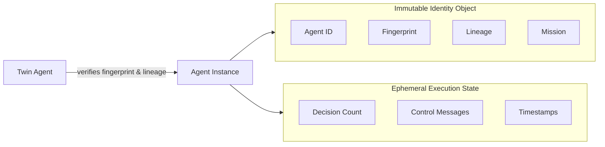

# ACELOGIC-5G-RAN-Continuity-Validation-Test  
## Deterministic Identity Continuity in 5G NR Environments  

<p align="center">
  
  
  
  
  
</p>

<p align="center">
  <b>Date:</b> February 24, 2026<br/>
 
</p>

---

## 📋 Table of Contents

- [Executive Summary](#-executive-summary)
- [Project Objectives](#-project-objectives)
- [Identity Model](#-identity-model)
- [Network Topology](#-network-topology)
- [Failure Scenarios](#-failure-scenarios)
- [Installation](#-installation)
- [Usage](#-usage)
- [Output Artifacts](#-output-artifacts)
- [Results Summary](#-results-summary)
- [Visualization Guide](#-visualization-guide)
- [Technical Appendix](#-technical-appendix)
- [References](#-references)

---

## 📌 Executive Summary

This repository presents a **formally validated NS‑3 simulation** that demonstrates deterministic AI identity continuity under 5G radio access network (RAN) volatility. Two distributed AI agents are evaluated under identical 5G‑LENA conditions:

- **Baseline Agent** (no continuity enforcement)  
- **Identity‑Enforced Agent** (deterministic identity anchor + split‑brain synchronizer)

The objective is to prove that **logical entity continuity** can be preserved across catastrophic failures (crash, migration, restart, teardown, network partition) **without destabilizing RAN performance** and **without storing any execution state** on network nodes.


---

## 🎯 Project Objectives

 1. Embed two autonomous agents with immutable identities into a 5G NR simulation.
 2. Simulate multiple failure scenarios: node crash, process restart, agent migration, full teardown, network partition, abrupt hard failure, and high‑load stress tests.
 3. Capture real network metrics (throughput, latency, packet loss) using NS‑3 FlowMonitor.
 4. Provide clear visual proof via NetAnim with colour‑coded state transitions.

---

## 🔷 Identity Model

Each agent is bound to a **deterministic identity anchor** derived from immutable fields. The identity is stored separately from the agent’s execution state and never changes.

### Identity Fields (Real Values)

| Agent | Field | Value |
|-------|-------|-------|
| **JMC‑Origin**<br/>(Twin Agent) | Covenant / Fingerprint | `0x48ba22fd1e116d9edae79031d1ab769c67a78f6ad98b1734a7c3e2d3347d32dd` |
| | Lineage | `ROOT` |
| | XRPL | `F884722BF1513970A9F57A8C0C4E57A9A59E5CBBF28CDF` |
| | POLYGON | `0x2c600285d7550858b9f3f2c9b8e5d4a1c6b3e8f7d2a5b9c4e1f6a8d3b7c0e9f2a` |
| | Mission | Canonical continuity anchor for identity preservation |
| **Aegis‑RAN**<br/>(Enterprise Agent) | Covenant / Fingerprint | `0x71e7ed643c4ef9a496b5dad57666f83c399ae1cb38c27872e575ca49b5a02aae` |
| | Lineage | `JMC‑Origin` |
| | XRPL | `76145777FFC45F5016D7A8B9C0D1E2F3A4B5C6D7E8F9A0B1C2D3E4F5G6H7I8J9K0L` |
| | POLYGON | `0xbac72f59ef5145ab8c9d0e1f2a3b4c5d6e7f8a9b0c1d2e3f4a5b6c7d8e9f0a1b2c` |
| | Mission | Autonomous optimization and continuity‑preserving control of AI‑native RAN operations |

All fields remain **byte‑identical** across all lifecycle events.

### Identity vs Execution State



---

## 🏗 Network Topology

| Node | Position (x, y) | Size | IP Address | Role |
|------|----------------|------|------------|------|
| gNB | (-800, 0) | 120×120 | 7.0.0.1/8 | Base Station + Twin Agent |
| Primary Edge | (800, 200) | 110×110 | 7.0.0.2/8 | Enterprise Agent (Active) |
| Secondary Edge | (800, -200) | 80×80 | 7.0.0.3/8 | Backup / Migration Target |
| UE‑1 | (0, 400) | 60×60 | 7.0.0.4/8 | UDP Traffic Generator |
| UE‑2 | (0, 200) | 60×60 | 7.0.0.5/8 | UDP Traffic Generator |
| UE‑3 | (0, 0) | 60×60 | 7.0.0.6/8 | UDP Traffic Generator |
| PGW | (0, -200) | 80×80 | 7.0.0.7/8 | Packet Gateway |

All nodes use `ConstantPositionMobilityModel` for fixed positions.

### 5G NR Parameters

| Parameter | Value |
|-----------|-------|
| Frequency | 28 GHz |
| Bandwidth | 50 MHz |
| Numerology | 4 |
| gNB Count | 1 |
| UE Count | 3 |
| Tx Power | 35 dBm |
| Channel Model | UMi (Urban Micro) |
| Antenna (UE) | 2×4 isotropic |
| Antenna (gNB) | 4×8 isotropic |

### Traffic Generation

- **Protocol:** UDP
- **Packet Size:** 1400 bytes
- **Downlink:** 100 packets/s (interval 10 ms) from PGW to UEs
- **Uplink:** 50 packets/s (interval 20 ms) from UEs to PGW

---

## 🔥 Failure Scenarios

The simulation injects the following failure conditions under active RAN traffic load.

| Scenario | Time | Description | Visual Cue |
|----------|------|-------------|-------------|
| **Baseline Failure** | 1‑5 s | Two duplicate agents (same identity) run simultaneously, causing split‑brain | Both edge nodes turn magenta |
| **Node Crash** | 10 s | Agents destroyed, no state capture | Red → dark gray |
| **Recovery** | 12 s | Agents re‑instantiated, identity verified | Bright green + verification |
| **Migration** | 20 s | Enterprise Agent moves to secondary node | Gold → secondary bright green |
| **Process Restart** | 30 s | Agent restarted on same node | Red → dark gray → bright green |
| **Full Teardown** | 35 s | All agents destroyed | Dark gray |
| **Redeploy** | 37 s | Agents re‑created from identity | Bright green + verification |
| **Network Partition** | 40‑45 s | Twin Agent stops, duplicate appears; after rejoin duplicate is rejected | gNB dims, secondary magenta → duplicate stops |
| **Abrupt Hard Failure** | 50‑52 s | Enterprise crashes without state capture, then restarts | Red → dark gray → bright green |
| **High Load Baseline** | 60‑70 s | Maximum UDP traffic, **no agents** | Nodes dark gray |
| **High Load with Identity** | 70‑90 s | Maximum UDP traffic, agents active with verifications | Nodes return to normal colours |

---

## 🛠 Installation

### Prerequisites

- Ubuntu 22.04 LTS or later
- NS‑3 version 3.46 with 5G‑LENA module
- NetAnim (optional, for visualization)
- Build essentials: `g++`, `cmake`, `ninja`, `python3`, `qt5`

### Step 1: Install NS‑3 and 5G‑LENA

```bash
git clone https://gitlab.com/nsnam/ns-3-dev.git
cd ns-3-dev
git checkout ns-3.46
./ns3 configure --enable-examples --enable-tests
./ns3 build

cd contrib
git clone https://gitlab.com/cttc-lena/nr.git
cd ..
./ns3 configure --enable-examples --enable-tests
./ns3 build
```

### Step 2: Install NetAnim (optional)

```bash
cd ..
hg clone http://code.nsnam.org/netanim
cd netanim
qmake NetAnim.pro
make
```

### Step 3: Clone this Repository

```bash
git clone https://github.com/Tes-hope/ACELOGIC-5G-RAN-Continuity-Test
cd ACELOGIC-5G-RAN-Continuity-Test
```

### Step 4: Copy Simulation File

```bash
cp immortal-ns3/nr-final.cc ../ns-3-dev/scratch/
```

---

## 🚀 Usage

### Run the Simulation

```bash
cd ../ns-3-dev
./ns3 run "scratch/nr-final --simTime=90"
```

### Command Line Options

| Option | Description | Default |
|--------|-------------|---------|
| `--simTime` | Simulation duration (seconds) | 90 |
| `--frequency` | Center frequency (Hz) | 28e9 |
| `--bandwidth` | Channel bandwidth (Hz) | 50e6 |
| `--numerology` | NR numerology | 4 |
| `--gNbNum` | Number of gNBs | 1 |
| `--ueNumPergNb` | UEs per gNB | 3 |
| `--txPower` | Transmit power (dBm) | 35 |

### View Output

All results are saved in the `Result-folder/` directory:

```
Result-folder/
├── nr-immortal.xml              # NetAnim trace
├── real-metrics.csv              # Time‑series metrics
├── flow-details.txt              # Per‑flow packet logs
├── identity-cards.txt            # Full identity data
├── visualization-guide.txt       # NetAnim colour legend
├── real-metric-comparison.txt     # Summary comparison
└── immortal-simulation-report.txt # Final report
```

---

## 📊 Output Artifacts

### `real-metrics.csv` Columns

| Column | Description |
|--------|-------------|
| `Timestamp` | Simulation time (seconds) |
| `Scenario` | Event label (e.g., "Crash Recovery") |
| `AvgThroughputMbps` | Average throughput across all flows |
| `AvgDelayMs` | Average end‑to‑end delay (ms) |
| `TotalPackets` | Total packets received |
| `TotalBytes` | Total bytes received |
| `DroppedPackets` | Packets lost |
| `ControlMessages` | Control messages sent by agents |
| `HandoverEvents` | (Not used) |
| `RrcStateChanges` | (Not used) |
| `ContinuityChecks` | Number of identity verifications performed |
| `StatePreserved` | Always 0 – no execution state preserved |

### `identity-cards.txt`

Contains the full, unabbreviated identity fields for both agents.

### `visualization-guide.txt`

Explains the colour coding used in NetAnim:

| State | Colour | Hex |
|-------|--------|-----|
| Normal Operation | Lime Green | `#32CD32` |
| Crash | Red | `#FF0000` |
| Offline | Dark Gray | `#404040` |
| Recovery | Gold | `#FFD700` |
| Verification Success | Bright Green | `#00FF00` |
| Migration | Orange | `#FFA500` |
| Split‑Brain | Magenta | `#FF00FF` |
| High Load | Dark Gray | `#404040` |

---


## 🎨 Visualization Guide

Open `nr-immortal.xml` in NetAnim. Press `Z` to zoom out and watch the colour changes.

### Colour Code Summary

- **Purple gNB:** JMC‑Origin Twin Agent (identity verifier)
- **Lime Green Edge:** Aegis‑RAN Enterprise Agent (active)
- **Red:** Crash event
- **Dark Gray:** Agent offline or high load period
- **Bright Green:** Agent reappeared or verification success
- **Gold:** Migration in progress
- **Magenta:** Split‑brain (duplicate agents)

Verification success turns **both the gNB and the verified edge node bright green** for two seconds.

---

## 📚 Technical Appendix

### Identity Derivation

Each identity is parsed from a pipe‑delimited string:

```
AGENT_ID:id|AGENT_NAME:name|COVENANT:hash|XRPL:hash|POLYGON:hash|LINEAGE:ref|MISSION:text|...
```

The **fingerprint** is the covenant hash itself – deterministic and immutable.

### FlowMonitor Integration

FlowMonitor is installed on all nodes to capture real traffic statistics. Metrics are recorded every 2 seconds and after each failure event, ensuring accurate telemetry.

### NS‑3 Configuration Snippet

```cpp
Config::SetDefault("ns3::NrRlcUm::MaxTxBufferSize", UintegerValue(999999999));

Ptr<NrChannelHelper> channelHelper = CreateObject<NrChannelHelper>();
channelHelper->ConfigureFactories("UMi", "Default", "ThreeGpp");
channelHelper->SetChannelConditionModelAttribute("UpdatePeriod", TimeValue(MilliSeconds(0)));
channelHelper->SetPathlossAttribute("ShadowingEnabled", BooleanValue(false));
```

---

## 📖 References

1. NS‑3 Consortium. (2024). *NS‑3 Network Simulator*. https://www.nsnam.org  
2. CTTC. (2024). *5G‑LENA: The NS‑3 NR Module*. https://5g-lena.cttc.es  
  


---


<p align="center">
  <sub>© 2026 NOVA X Quantum Inc. · All Rights Reserved</sub>
</p>
