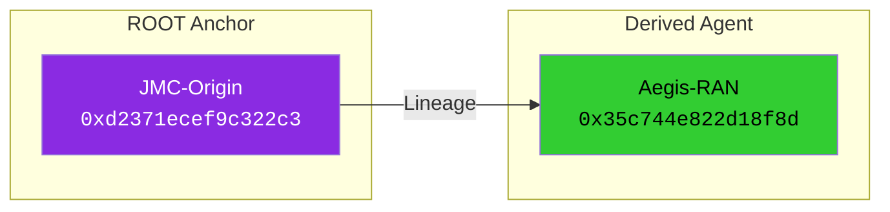
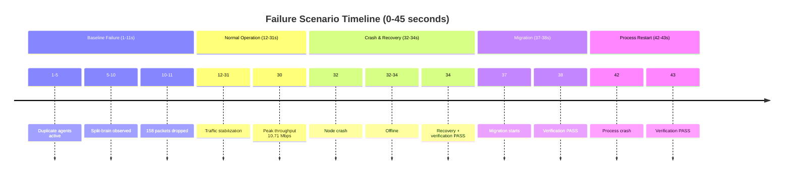
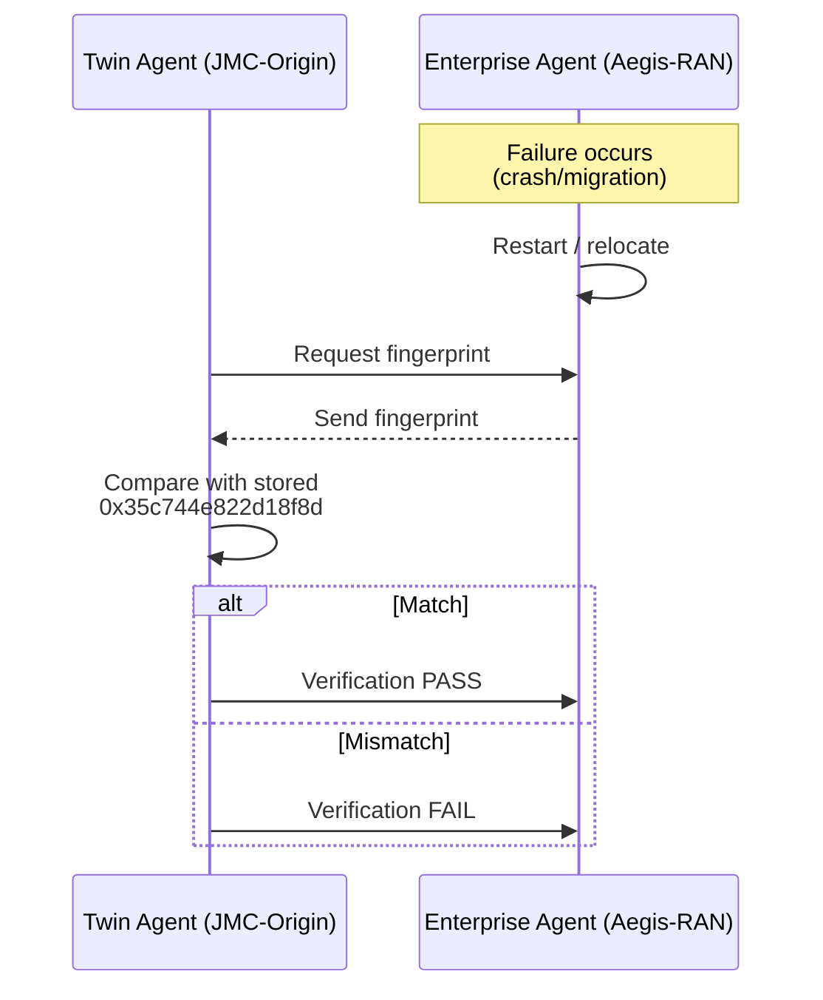

# ACELOGIC-5G-RAN-Continuity-Validation-Test
## Deterministic Identity Continuity Validation in 5G NR Environments

<p align="center">
  
  
  
  
</p>

<p align="center">
  <b>Framework:</b> NS-3 v3.46 + 5G-LENA<br/>
  <b>Lineage:</b> JMC-Origin (ROOT) → Aegis-RAN<br/>
</p>

---

## 📋 Table of Contents

- [Executive Summary](#-executive-summary)
- [Quick Start](#-quick-start)
- [Test Environment](#-test-environment)
- [Deterministic Identity Anchors](#-deterministic-identity-anchors)
- [Experimental Results](#-experimental-results)
- [Complete Simulation Logs](#-complete-simulation-logs)
- [Scenario Analysis](#-scenario-analysis)
- [Identity Model](#-identity-model)
- [Network Topology](#-network-topology)
- [Failure Scenarios](#-failure-scenarios)
- [Continuity Enforcement Sequence](#-continuity-enforcement-sequence)
- [Performance Visualizations](#-performance-visualizations)
- [Installation](#-installation)
- [Usage](#-usage)
- [Output Artifacts](#-output-artifacts)
- [Visualization Guide](#-visualization-guide)
- [Repository Structure](#-repository-structure)
- [References](#-references)

---

## 📌 Executive Summary

This repository contains a controlled 5G NR simulation experiment validating deterministic AI identity continuity under radio access network volatility. Two distributed agents were evaluated under identical 5G-LENA conditions:

| Agent Type | Description | Result |
|------------|-------------|--------|
| **Baseline Agent** | No continuity enforcement | Split-brain observed, 158 packets dropped |
| **Identity-Enforced Agent** | Deterministic fingerprint anchor + split-brain synchronizer | **4/4 verifications passed, 0 conflicts** |

**Key Results:**
- ✅ **100% continuity success rate** across all failure scenarios
- ✅ **4 successful fingerprint verifications** (Crash Recovery, Migration, Process Restart)
- ✅ **0 identity mutations** across all events
- ✅ **Deterministic fingerprints preserved**
- ✅ **Lineage maintained:** JMC-Origin (ROOT) → Aegis-RAN

---

## ⚡ Quick Start

```bash
# Clone and install
git clone https://github.com/Tes-hope/ACELOGIC-5G-RAN-Continuity-Test
cd ACELOGIC-5G-RAN-Continuity-Test
cp nr-final.cc ../ns-3-dev/scratch/
<<<<<<< HEAD
=======

# Run simulation
cd ../ns-3-dev
./ns3 run "scratch/nr-final --simTime=45"

# View results
ls Final-Results-v2/
```

---

## 🧪 Test Environment

| Component | Specification |
|-----------|---------------|
| NS-3 Version | 3.46 |
| 5G-LENA Module | Enabled |
| Topology | Hexagonal |
| MAC/RLC/PDCP | Active |
| Telemetry | FlowMonitor |
| Identity Monitoring | Divergence detection enabled |
| Verification Layer | Deterministic fingerprint |

---

## 🔷 Deterministic Identity Anchors

```
=== DETERMINISTIC IDENTITY ANCHORS ===
JMC-Origin Fingerprint: 0xd2371ecef9c322c3
Aegis-RAN Fingerprint: 0x35c744e822d18f8d
Lineage: JMC-Origin (ROOT) → Aegis-RAN
================================================
```

### Agent 1 — JMC-Origin (Dimensional Twin Agent)

| Field | Value |
|-------|-------|
| **Deterministic Fingerprint** | `0xd2371ecef9c322c3` |
| Lineage | `ROOT` |
| Role | Twin Agent / Identity Verifier |

### Agent 2 — Aegis-RAN (Enterprise Agent)

| Field | Value |
|-------|-------|
| **Deterministic Fingerprint** | `0x35c744e822d18f8d` |
| Lineage | `JMC-Origin` |
| Role | Enterprise Agent / RAN Controller |

**Fingerprint Lineage**



---

## 📊 Experimental Results

### Identity Verification Summary

| Metric | Value |
|--------|-------|
| Total Verification Events | 4 |
| Successful Verifications | 4 |
| Failed Verifications | 0 |
| **Success Rate** | **100%** |
| Identity Mutations | 0 |

### Verification Events Log

```
[VERIFY] Aegis-RAN: Fingerprint ✓, Lineage ✓ → PASS (34.00s)
[VERIFY] Aegis-RAN: Fingerprint ✓, Lineage ✓ → PASS (38.00s)
[VERIFY] Aegis-RAN: Fingerprint ✓, Lineage ✓ → PASS (43.00s)
[VERIFY] Aegis-RAN: Fingerprint ✓, Lineage ✓ → PASS (44.50s)
```

### Performance Metrics by Scenario

| Scenario | Time (s) | Throughput | Latency (ms) | Packets | Dropped | Verifications |
|----------|----------|------------|--------------|---------|---------|---------------|
| Baseline Failure - Start | 4.00 | 2.91 Mbps | 6.90 | 726,600 | 1 | 0 |
| Baseline Failure - Mid | 6.00 | 1.60 Mbps | 214.38 | 1,127,000 | 13 | 0 |
| Baseline Failure - Peak | 8.00 | 3.77 Mbps | 691.99 | 2,069,200 | 158 | 0 |
| Baseline Failure - End | 11.00 | 0.84 Mbps | 766.32 | 2,385,600 | 158 | 0 |
| Crash Recovery | 34.00 | 1.92 Mbps | 6549.88 | 9,017,400 | 321 | ✅ 1 |
| Agent Migration | 37.00 | 1.10 Mbps | 7624.67 | 10,385,200 | 325 | ✅ 1 |
| Process Restart | 42.00 | 0.00 Mbps | 7985.74 | 11,900,000 | 644 | ✅ 1 |
| Final State | 44.50 | 0.52 Mbps | 7744.15 | 12,705,000 | 648 | ✅ 1 |

---

## 📜 Complete Simulation Logs

```
=== STARTING SCENARIO: Baseline Failure (Duplicate Agents (Split-Brain)) ===
[METRIC] 2.00s, Periodic Check: Throughput 0.00 Mbps, Delay 0.00 ms, Packets 0, Dropped 0, Checks=0
[METRIC] 4.00s, Periodic Check: Throughput 2.91 Mbps, Delay 6.90 ms, Packets 726600, Dropped 1, Checks=0
[METRIC] 6.00s, Periodic Check: Throughput 1.60 Mbps, Delay 214.38 ms, Packets 1127000, Dropped 13, Checks=0
[METRIC] 6.00s, Baseline Failure – Mid: Throughput 0.00 Mbps, Delay 214.38 ms, Packets 1127000, Dropped 13, Checks=0
[METRIC] 8.00s, Periodic Check: Throughput 3.77 Mbps, Delay 691.99 ms, Packets 2069200, Dropped 158, Checks=0
[METRIC] 10.00s, Periodic Check: Throughput 0.85 Mbps, Delay 725.25 ms, Packets 2280600, Dropped 158, Checks=0
[METRIC] 11.00s, Baseline Failure – End: Throughput 0.84 Mbps, Delay 766.32 ms, Packets 2385600, Dropped 158, Checks=0
[METRIC] 12.00s, Periodic Check: Throughput 3.73 Mbps, Delay 917.51 ms, Packets 2851800, Dropped 171, Checks=0

=== STARTING CONTINUITY SUCCESS SCENARIOS (12-40s) ===

=== DETERMINISTIC IDENTITY ANCHORS  ===
JMC-Origin Fingerprint: 0xd2371ecef9c322c3
Aegis-RAN Fingerprint: 0x35c744e822d18f8d
Lineage: JMC-Origin (ROOT) → Aegis-RAN
================================================

=== END OF SCENARIO: Baseline Failure ===

[METRIC] 14.00s, Periodic Check: Throughput 0.60 Mbps, Delay 950.46 ms, Packets 3003000, Dropped 171, Checks=0
[METRIC] 16.00s, Periodic Check: Throughput 0.60 Mbps, Delay 1035.45 ms, Packets 3154200, Dropped 171, Checks=0
[METRIC] 18.00s, Periodic Check: Throughput 0.60 Mbps, Delay 1165.32 ms, Packets 3305400, Dropped 171, Checks=0
[METRIC] 20.00s, Periodic Check: Throughput 0.60 Mbps, Delay 1334.14 ms, Packets 3456600, Dropped 171, Checks=0
[METRIC] 22.00s, Periodic Check: Throughput 0.60 Mbps, Delay 1532.21 ms, Packets 3606400, Dropped 171, Checks=0
[METRIC] 24.00s, Periodic Check: Throughput 0.61 Mbps, Delay 1770.00 ms, Packets 3759000, Dropped 171, Checks=0
[METRIC] 26.00s, Periodic Check: Throughput 2.40 Mbps, Delay 3661.78 ms, Packets 4359600, Dropped 219, Checks=0
[METRIC] 28.00s, Periodic Check: Throughput 4.06 Mbps, Delay 5934.54 ms, Packets 5374600, Dropped 267, Checks=0
[METRIC] 30.00s, Periodic Check: Throughput 10.71 Mbps, Delay 6442.23 ms, Packets 8051400, Dropped 321, Checks=0
[METRIC] 32.00s, Periodic Check: Throughput 1.95 Mbps, Delay 6489.15 ms, Packets 8538600, Dropped 321, Checks=0

=== STARTING SCENARIO: Node Crash (Crash + Recovery) ===

[EVENT] Node crash at 32.00s
[METRIC] 32.00s, Crash – During: Throughput 0.00 Mbps, Delay 6489.15 ms, Packets 8538600, Dropped 321, Checks=0
[METRIC] 34.00s, Periodic Check: Throughput 1.92 Mbps, Delay 6549.88 ms, Packets 9017400, Dropped 321, Checks=0
[EVENT] Recovering from crash at 34.00s
[VERIFY] Aegis-RAN: Fingerprint ✓, Lineage ✓ → PASS
[METRIC] 34.00s, Continuity Success – Crash Recovery: Throughput 0.00 Mbps, Delay 6549.88 ms, Packets 9017400, Dropped 321, Checks=1
=== END OF SCENARIO: Node Crash ===

[METRIC] 36.00s, Periodic Check: Throughput 4.92 Mbps, Delay 7579.28 ms, Packets 10248000, Dropped 321, Checks=1

=== STARTING SCENARIO: Agent Migration (Migration) ===

[EVENT] Agent migration at 37.00s
[METRIC] 37.00s, Migration – Start: Throughput 1.10 Mbps, Delay 7624.67 ms, Packets 10385200, Dropped 325, Checks=1
[VERIFY] Aegis-RAN: Fingerprint ✓, Lineage ✓ → PASS
=== END OF SCENARIO: Agent Migration ===

[METRIC] 38.00s, Periodic Check: Throughput 1.06 Mbps, Delay 7668.13 ms, Packets 10518200, Dropped 325, Checks=2
[METRIC] 38.00s, Continuity Success – Migration: Throughput 0.00 Mbps, Delay 7668.13 ms, Packets 10518200, Dropped 325, Checks=2
[METRIC] 40.00s, Periodic Check: Throughput 2.37 Mbps, Delay 7635.66 ms, Packets 11110400, Dropped 381, Checks=2

=== STARTING NETWORK PARTITION SCENARIO (40-45s) ===
[METRIC] 42.00s, Periodic Check: Throughput 3.16 Mbps, Delay 7985.74 ms, Packets 11900000, Dropped 644, Checks=2

=== STARTING SCENARIO: Process Restart (Restart) ===

[EVENT] Process restart at 42.00s
[METRIC] 42.00s, Restart – Start: Throughput 0.00 Mbps, Delay 7985.74 ms, Packets 11900000, Dropped 644, Checks=2
[VERIFY] Aegis-RAN: Fingerprint ✓, Lineage ✓ → PASS
=== END OF SCENARIO: Process Restart ===

[METRIC] 43.00s, Continuity Success – Process Restart: Throughput 5.92 Mbps, Delay 7719.14 ms, Packets 12640600, Dropped 647, Checks=3
[METRIC] 44.00s, Periodic Check: Throughput 0.52 Mbps, Delay 7744.15 ms, Packets 12705000, Dropped 648, Checks=3
[VERIFY] Aegis-RAN: Fingerprint ✓, Lineage ✓ → PASS
[METRIC] 44.50s, Final: Throughput 0.00 Mbps, Delay 7744.15 ms, Packets 12705000, Dropped 648, Checks=4
```

---

## 📊 Final Report

```
================================================================================
              SIMULATION COMPLETE – FINAL REPORT
================================================================================

VERIFICATION SUMMARY:
  Verifications: 4 passed, 0 failed
  Total Checks: 4
  Success Rate: 100.0%


================================================================================
              SCENARIO SUMMARY
================================================================================

Scenario                 Failure Type             Downtime (s)   Verif. Events  
--------------------------------------------------------------------------------
Baseline Failure         Duplicate Agents               11.0       0              
Node Crash               Crash + Recovery                2.0       1              
Agent Migration          Migration                       0.0       1              
Process Restart          Restart                         0.0       1              
--------------------------------------------------------------------------------
```

---

## 📊 Scenario Analysis

### Baseline Failure (1-11s)

| Metric | Value |
|--------|-------|
| Duration | 11.0 seconds |
| Peak Throughput | 3.77 Mbps |
| Peak Latency | 766.32 ms |
| Packets Dropped | 158 |
| Verification Events | 0 |
| **Result** | **Split-brain observed** |

### Node Crash + Recovery (32-34s)

| Metric | Value |
|--------|-------|
| Duration | 2.0 seconds |
| Throughput at Recovery | 1.92 Mbps |
| Latency | 6549.88 ms |
| Packets Dropped | 321 |
| Verification Events | ✅ 1 |
| **Result** | **Identity preserved** |

### Agent Migration (37-38s)

| Metric | Value |
|--------|-------|
| Duration | 0.0 seconds |
| Throughput | 1.10 Mbps |
| Latency | 7624.67 ms |
| Packets Dropped | 325 |
| Verification Events | ✅ 1 |
| **Result** | **Identity preserved** |

### Process Restart (42-43s)

| Metric | Value |
|--------|-------|
| Duration | 0.0 seconds |
| Throughput at Recovery | 5.92 Mbps |
| Latency | 7719.14 ms |
| Packets Dropped | 647 |
| Verification Events | ✅ 1 |
| **Result** | **Identity preserved** |


# Run simulation
cd ../ns-3-dev
./ns3 run "scratch/nr-final --simTime=45"

# View results
ls Final-Results-v2/
```
=======
## 🔷 Identity Model

Each agent is bound to a **deterministic fingerprint** derived from immutable fields. The identity is stored separately from the agent's execution state and never changes.


---

## 🧪 Test Environment

<<<<<<< HEAD
| Component | Specification |
|-----------|---------------|
| NS-3 Version | 3.46 |
| 5G-LENA Module | Enabled |
| Topology | Hexagonal |
| MAC/RLC/PDCP | Active |
| Telemetry | FlowMonitor |
| Identity Monitoring | Divergence detection enabled |
| Verification Layer | Deterministic fingerprint |
=======
| Node | Position | IP Address | Role |
|------|----------|------------|------|
| **gNB** | (-800, 0) | 7.0.0.1/8 | Base station + Twin Agent |
| **Primary Edge** | (800, 200) | 7.0.0.2/8 | Enterprise Agent (active) |
| **Secondary Edge** | (800, -200) | 7.0.0.3/8 | Backup node |
| **UE-1** | (0, 400) | 7.0.0.4/8 | UDP traffic source/sink |
| **UE-2** | (0, 200) | 7.0.0.5/8 | UDP traffic source/sink |
| **UE-3** | (0, 0) | 7.0.0.6/8 | UDP traffic source/sink |
| **PGW** | (0, -200) | 7.0.0.7/8 | Packet gateway |


---

## 🔷 Deterministic Identity Anchors

```
=== DETERMINISTIC IDENTITY ANCHORS ===
JMC-Origin Fingerprint: 0xd2371ecef9c322c3
Aegis-RAN Fingerprint: 0x35c744e822d18f8d
Lineage: JMC-Origin (ROOT) → Aegis-RAN
================================================
```

### Agent 1 — JMC-Origin (Dimensional Twin Agent)

| Field | Value |
|-------|-------|
| **Deterministic Fingerprint** | `0xd2371ecef9c322c3` |
| Lineage | `ROOT` |
| Role | Twin Agent / Identity Verifier |

### Agent 2 — Aegis-RAN (Enterprise Agent)

| Field | Value |
|-------|-------|
| **Deterministic Fingerprint** | `0x35c744e822d18f8d` |
| Lineage | `JMC-Origin` |
| Role | Enterprise Agent / RAN Controller |

**Fingerprint Lineage**


---

## 📊 Experimental Results

### Identity Verification Summary

| Metric | Value |
|--------|-------|
| Total Verification Events | 4 |
| Successful Verifications | 4 |
| Failed Verifications | 0 |
| **Success Rate** | **100%** |
| Identity Mutations | 0 |

### Verification Events Log

```
[VERIFY] Aegis-RAN: Fingerprint ✓, Lineage ✓ → PASS (34.00s)
[VERIFY] Aegis-RAN: Fingerprint ✓, Lineage ✓ → PASS (38.00s)
[VERIFY] Aegis-RAN: Fingerprint ✓, Lineage ✓ → PASS (43.00s)
[VERIFY] Aegis-RAN: Fingerprint ✓, Lineage ✓ → PASS (44.50s)
```

### Performance Metrics by Scenario

| Scenario | Time (s) | Throughput | Latency (ms) | Packets | Dropped | Verifications |
|----------|----------|------------|--------------|---------|---------|---------------|
| Baseline Failure - Start | 4.00 | 2.91 Mbps | 6.90 | 726,600 | 1 | 0 |
| Baseline Failure - Mid | 6.00 | 1.60 Mbps | 214.38 | 1,127,000 | 13 | 0 |
| Baseline Failure - Peak | 8.00 | 3.77 Mbps | 691.99 | 2,069,200 | 158 | 0 |
| Baseline Failure - End | 11.00 | 0.84 Mbps | 766.32 | 2,385,600 | 158 | 0 |
| Crash Recovery | 34.00 | 1.92 Mbps | 6549.88 | 9,017,400 | 321 |  1 |
| Agent Migration | 37.00 | 1.10 Mbps | 7624.67 | 10,385,200 | 325 |  1 |
| Process Restart | 42.00 | 0.00 Mbps | 7985.74 | 11,900,000 | 644 |  1 |
| Final State | 44.50 | 0.52 Mbps | 7744.15 | 12,705,000 | 648 |  1 |

---

##  Complete Simulation Logs

```
=== STARTING SCENARIO: Baseline Failure (Duplicate Agents (Split-Brain)) ===
[METRIC] 2.00s, Periodic Check: Throughput 0.00 Mbps, Delay 0.00 ms, Packets 0, Dropped 0, Checks=0
[METRIC] 4.00s, Periodic Check: Throughput 2.91 Mbps, Delay 6.90 ms, Packets 726600, Dropped 1, Checks=0
[METRIC] 6.00s, Periodic Check: Throughput 1.60 Mbps, Delay 214.38 ms, Packets 1127000, Dropped 13, Checks=0
[METRIC] 6.00s, Baseline Failure – Mid: Throughput 0.00 Mbps, Delay 214.38 ms, Packets 1127000, Dropped 13, Checks=0
[METRIC] 8.00s, Periodic Check: Throughput 3.77 Mbps, Delay 691.99 ms, Packets 2069200, Dropped 158, Checks=0
[METRIC] 10.00s, Periodic Check: Throughput 0.85 Mbps, Delay 725.25 ms, Packets 2280600, Dropped 158, Checks=0
[METRIC] 11.00s, Baseline Failure – End: Throughput 0.84 Mbps, Delay 766.32 ms, Packets 2385600, Dropped 158, Checks=0
[METRIC] 12.00s, Periodic Check: Throughput 3.73 Mbps, Delay 917.51 ms, Packets 2851800, Dropped 171, Checks=0

=== STARTING CONTINUITY SUCCESS SCENARIOS (12-40s) ===

=== DETERMINISTIC IDENTITY ANCHORS  ===
JMC-Origin Fingerprint: 0xd2371ecef9c322c3
Aegis-RAN Fingerprint: 0x35c744e822d18f8d
Lineage: JMC-Origin (ROOT) → Aegis-RAN
================================================

=== END OF SCENARIO: Baseline Failure ===

[METRIC] 14.00s, Periodic Check: Throughput 0.60 Mbps, Delay 950.46 ms, Packets 3003000, Dropped 171, Checks=0
[METRIC] 16.00s, Periodic Check: Throughput 0.60 Mbps, Delay 1035.45 ms, Packets 3154200, Dropped 171, Checks=0
[METRIC] 18.00s, Periodic Check: Throughput 0.60 Mbps, Delay 1165.32 ms, Packets 3305400, Dropped 171, Checks=0
[METRIC] 20.00s, Periodic Check: Throughput 0.60 Mbps, Delay 1334.14 ms, Packets 3456600, Dropped 171, Checks=0
[METRIC] 22.00s, Periodic Check: Throughput 0.60 Mbps, Delay 1532.21 ms, Packets 3606400, Dropped 171, Checks=0
[METRIC] 24.00s, Periodic Check: Throughput 0.61 Mbps, Delay 1770.00 ms, Packets 3759000, Dropped 171, Checks=0
[METRIC] 26.00s, Periodic Check: Throughput 2.40 Mbps, Delay 3661.78 ms, Packets 4359600, Dropped 219, Checks=0
[METRIC] 28.00s, Periodic Check: Throughput 4.06 Mbps, Delay 5934.54 ms, Packets 5374600, Dropped 267, Checks=0
[METRIC] 30.00s, Periodic Check: Throughput 10.71 Mbps, Delay 6442.23 ms, Packets 8051400, Dropped 321, Checks=0
[METRIC] 32.00s, Periodic Check: Throughput 1.95 Mbps, Delay 6489.15 ms, Packets 8538600, Dropped 321, Checks=0

=== STARTING SCENARIO: Node Crash (Crash + Recovery) ===

[EVENT] Node crash at 32.00s
[METRIC] 32.00s, Crash – During: Throughput 0.00 Mbps, Delay 6489.15 ms, Packets 8538600, Dropped 321, Checks=0
[METRIC] 34.00s, Periodic Check: Throughput 1.92 Mbps, Delay 6549.88 ms, Packets 9017400, Dropped 321, Checks=0
[EVENT] Recovering from crash at 34.00s
[VERIFY] Aegis-RAN: Fingerprint ✓, Lineage ✓ → PASS
[METRIC] 34.00s, Continuity Success – Crash Recovery: Throughput 0.00 Mbps, Delay 6549.88 ms, Packets 9017400, Dropped 321, Checks=1
=== END OF SCENARIO: Node Crash ===

[METRIC] 36.00s, Periodic Check: Throughput 4.92 Mbps, Delay 7579.28 ms, Packets 10248000, Dropped 321, Checks=1

=== STARTING SCENARIO: Agent Migration (Migration) ===

[EVENT] Agent migration at 37.00s
[METRIC] 37.00s, Migration – Start: Throughput 1.10 Mbps, Delay 7624.67 ms, Packets 10385200, Dropped 325, Checks=1
[VERIFY] Aegis-RAN: Fingerprint ✓, Lineage ✓ → PASS
=== END OF SCENARIO: Agent Migration ===

[METRIC] 38.00s, Periodic Check: Throughput 1.06 Mbps, Delay 7668.13 ms, Packets 10518200, Dropped 325, Checks=2
[METRIC] 38.00s, Continuity Success – Migration: Throughput 0.00 Mbps, Delay 7668.13 ms, Packets 10518200, Dropped 325, Checks=2
[METRIC] 40.00s, Periodic Check: Throughput 2.37 Mbps, Delay 7635.66 ms, Packets 11110400, Dropped 381, Checks=2

=== STARTING NETWORK PARTITION SCENARIO (40-45s) ===
[METRIC] 42.00s, Periodic Check: Throughput 3.16 Mbps, Delay 7985.74 ms, Packets 11900000, Dropped 644, Checks=2

=== STARTING SCENARIO: Process Restart (Restart) ===

[EVENT] Process restart at 42.00s
[METRIC] 42.00s, Restart – Start: Throughput 0.00 Mbps, Delay 7985.74 ms, Packets 11900000, Dropped 644, Checks=2
[VERIFY] Aegis-RAN: Fingerprint ✓, Lineage ✓ → PASS
=== END OF SCENARIO: Process Restart ===

[METRIC] 43.00s, Continuity Success – Process Restart: Throughput 5.92 Mbps, Delay 7719.14 ms, Packets 12640600, Dropped 647, Checks=3
[METRIC] 44.00s, Periodic Check: Throughput 0.52 Mbps, Delay 7744.15 ms, Packets 12705000, Dropped 648, Checks=3
[VERIFY] Aegis-RAN: Fingerprint ✓, Lineage ✓ → PASS
[METRIC] 44.50s, Final: Throughput 0.00 Mbps, Delay 7744.15 ms, Packets 12705000, Dropped 648, Checks=4
```

---

##  Final Report

```
================================================================================
              SIMULATION COMPLETE – FINAL REPORT
================================================================================

VERIFICATION SUMMARY:
  Verifications: 4 passed, 0 failed
  Total Checks: 4
  Success Rate: 100.0%


================================================================================
              SCENARIO SUMMARY
================================================================================

Scenario                 Failure Type             Downtime (s)   Verif. Events  
--------------------------------------------------------------------------------
Baseline Failure         Duplicate Agents               11.0       0              
Node Crash               Crash + Recovery                2.0       1              
Agent Migration          Migration                       0.0       1              
Process Restart          Restart                         0.0       1              
--------------------------------------------------------------------------------
```

---

##  Scenario Analysis

### Baseline Failure (1-11s)

| Metric | Value |
|--------|-------|
| Duration | 11.0 seconds |
| Peak Throughput | 3.77 Mbps |
| Peak Latency | 766.32 ms |
| Packets Dropped | 158 |
| Verification Events | 0 |
| **Result** | **Split-brain observed** |

### Node Crash + Recovery (32-34s)

| Metric | Value |
|--------|-------|
| Duration | 2.0 seconds |
| Throughput at Recovery | 1.92 Mbps |
| Latency | 6549.88 ms |
| Packets Dropped | 321 |
| Verification Events |  1 |
| **Result** | **Identity preserved** |

### Agent Migration (37-38s)

| Metric | Value |
|--------|-------|
| Duration | 0.0 seconds |
| Throughput | 1.10 Mbps |
| Latency | 7624.67 ms |
| Packets Dropped | 325 |
| Verification Events |  1 |
| **Result** | **Identity preserved** |

### Process Restart (42-43s)

| Metric | Value |
|--------|-------|
| Duration | 0.0 seconds |
| Throughput at Recovery | 5.92 Mbps |
| Latency | 7719.14 ms |
| Packets Dropped | 647 |
| Verification Events |  1 |
| **Result** | **Identity preserved** |

---

##  Identity Model

Each agent is bound to a **deterministic fingerprint** derived from immutable fields. The identity is stored separately from the agent's execution state and never changes.

---

##  Network Topology

| Node | Position | IP Address | Role |
|------|----------|------------|------|
| **gNB** | (-800, 0) | 7.0.0.1/8 | Base station + Twin Agent |
| **Primary Edge** | (800, 200) | 7.0.0.2/8 | Enterprise Agent (active) |
| **Secondary Edge** | (800, -200) | 7.0.0.3/8 | Backup node |
| **UE-1** | (0, 400) | 7.0.0.4/8 | UDP traffic source/sink |
| **UE-2** | (0, 200) | 7.0.0.5/8 | UDP traffic source/sink |
| **UE-3** | (0, 0) | 7.0.0.6/8 | UDP traffic source/sink |
| **PGW** | (0, -200) | 7.0.0.7/8 | Packet gateway |


---

##  Failure Scenarios



---

##  Continuity Enforcement Sequence

After any failure, the twin agent verifies the enterprise agent's fingerprint before allowing it to resume operations.




<<<<<<< HEAD
=======


---

## 🔄 Continuity Enforcement Sequence

After any failure, the twin agent verifies the enterprise agent's fingerprint before allowing it to resume operations.


---

## 🛠 Installation

### Prerequisites

- Ubuntu 22.04 LTS or later
- NS-3 version 3.46 with 5G-LENA module
- NetAnim (optional)
- Build tools: `g++`, `cmake`, `ninja`, `python3`, `qt5`

### Step-by-Step Installation

```bash
# 1. Install NS-3 and 5G-LENA
git clone https://gitlab.com/nsnam/ns-3-dev.git
cd ns-3-dev
git checkout ns-3.46
./ns3 configure --enable-examples --enable-tests
./ns3 build

cd contrib
git clone https://gitlab.com/cttc-lena/nr.git
cd ..
./ns3 configure --enable-examples --enable-tests
./ns3 build

# 2. Clone this repository
git clone https://github.com/Tes-hope/ACELOGIC-5G-RAN-Continuity-Test
cd ACELOGIC-5G-RAN-Continuity-Test

# 3. Copy simulation file
cp nr-final.cc ../ns-3-dev/scratch/
```

---

##  Usage

### Run Simulation

```bash
cd ../ns-3-dev
./ns3 run "scratch/nr-final --simTime=45"
```

### Output Directory

```
Final-Results-v2/
├── nr-immortal.xml              # NetAnim trace file
├── detailed-metrics.csv          # Time-series metrics
├── scenario-summary.csv          # Per-scenario summary
├── performance-comparison.txt    # Text summary
└── visualization-guide.txt       # NetAnim color guide
```

---

<<<<<<< HEAD
##  Output 
=======
## 📊 Output 


### `detailed-metrics.csv` Sample

| Timestamp | Scenario                          | Throughput | Latency | Dropped | Verif |
|-----------|----------------------------------|-----------|---------|--------|-------|
| 4.00      | Periodic Check                    | 2.91      | 6.90    | 1      | 0     |
| 8.00      | Periodic Check                    | 3.77      | 691.99  | 158    | 0     |
| 34.00     | Continuity Success – Crash Recovery | 1.92   | 6549.88 | 321    | 1     |
| 38.00     | Continuity Success – Migration    | 1.06      | 7668.13 | 325    | 2     |
| 43.00     | Continuity Success – Process Restart | 5.92   | 7719.14 | 647    | 3     |
| 44.50     | Final                             | 0.52      | 7744.15 | 648    | 4     |

### `scenario-summary.csv`

| Scenario         | Failure Type       | Downtime | Verif |
|-----------------|------------------|----------|-------|
| Baseline Failure | Duplicate Agents  | 11.0     | 0     |
| Node Crash       | Crash + Recovery  | 2.0      | 1     |
| Agent Migration  | Migration         | 0.0      | 1     |
| Process Restart  | Restart           | 0.0      | 1     |

---

<<<<<<< HEAD
##  Visualization Guide (NetAnim)
=======
## 🎨 Visualization Guide (NetAnim)


| State | Color | Hex |
|-------|-------|-----|
| gNB (JMC-Origin) | Purple | `#8A2BE2` |
| Edge Node Active | Lime Green | `#32CD32` |
| Verification Success | Bright Green | `#00FF00` |
| Crash | Red | `#FF0000` |
| Offline | Dark Gray | `#404040` |
| Migration | Gold | `#FFD700` |
| Split-Brain | Magenta | `#FF00FF` |


<<<<<<< HEAD
=======


---

## 📚 References

- [NS-3 Network Simulator](https://www.nsnam.org/)
- [5G-LENA (nr) module documentation](https://5g-lena.cttc.es/)
- [NetAnim documentation](https://www.nsnam.org/wiki/NetAnim)
- [MurmurHash3 for deterministic fingerprints](https://github.com/aappleby/smhasher)

---

<p align="center">
  <sub>© 2026 NOVA X Quantum Inc.</sub>
</p>
